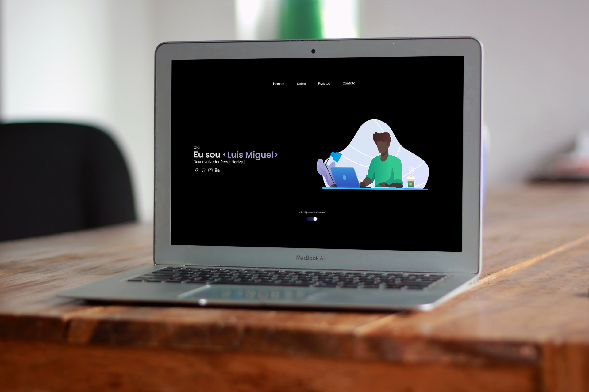
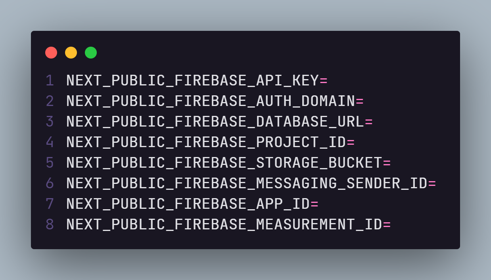
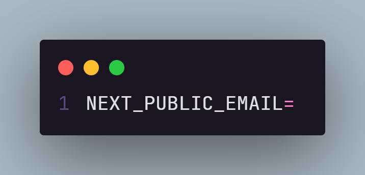

# 🏅 Portfólio

 

🔛 **Online agora: [lmiguelm](https://lmiguelm.vercel.app).**

 

# 🎥 Video de demosntração

 

## 🚀 Tecnologias:

Esse projeto foi desenvolvido com as seguintes tecnologias:

- [Next.js](https://reactjs.org)
- [Next-pwa](https://www.npmjs.com/package/next-pwa)
- [TypeScript](https://www.typescriptlang.org/)
- [Styled components](https://styled-components.com/)
- [Framer motion](https://www.framer.com/motion/)
- [Firebase](https://firebase.google.com/?hl=pt)

 

## ⚙ Configuração

- Este projeto utiliza [Firebase](https://firebase.google.com/?hl=pt), então antes de usar configure coloque as configurações de seu projeto:
  

 

- Configure seu email para conseguir logar na área restrita:
  

 

## 💻 Como usar

- **_Clone o projeto:_**
  ` git clone https://github.com/lmiguelm/portfolio.git`

 

- **_Entre na pasta do projeto:_**
  `cd portfolio`

 

- **_Baixe as dependências:_**
  ` yarn || npm install`

 

- **_Rodar o site:_**
  `yarn dev || npm run dev`

 

## 📝 Licença

Esse projeto está sob a licença MIT. Veja o arquivo [LICENSE](https://github.com/lmiguelm/portfolio/blob/master/LICENSE.md) para mais detalhes.
